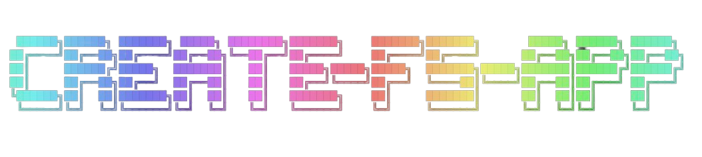
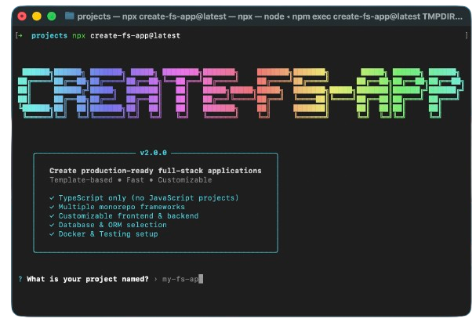

<div align="center">
  
  
  **Stop configuring. Start building.**
  
  Production-ready full-stack monorepo in 60 seconds.
  
  [](https://www.npmjs.com/package/create-fs-app)
  [](https://www.npmjs.com/package/create-fs-app)
  [](https://github.com/Om-jannu/create-fs-app/blob/master/LICENSE)
  
  <a href="https://github.com/sponsors/Om-jannu">
    
  </a>
</div>

---

## ⚡ Quick Start

```bash
npx create-fs-app@latest my-app
```

That's it. Seriously.

<div align="center">
  
</div>

## 🎯 What You Get

```
my-app/
├── apps/
│   ├── frontend/    # React/Next.js/Vue
│   └── backend/     # Express/NestJS/Fastify
├── packages/
│   └── shared/      # Shared code
└── Ready to deploy 🚀
```

**Everything configured:**
- ✅ TypeScript
- ✅ Monorepo (Turborepo/Nx)
- ✅ Database + ORM
- ✅ Docker
- ✅ Linting & Formatting
- ✅ Git initialized

## 🎨 Choose Your Stack

**Interactive mode** - Answer a few questions:
```bash
npx create-fs-app@latest my-app
```

**CLI mode** - Skip the questions:
```bash
npx create-fs-app@latest my-app \
  --monorepo turborepo \
  --frontend next.js \
  --backend nest.js \
  --database postgresql \
  --orm prisma
```

**Template mode** - Use a preset:
```bash
npx create-fs-app@latest my-app --template turborepo-nextjs-nestjs-postgresql-prisma
```

## 🛠️ Tech Stack Options

<table>
<tr>
<td width="50%">

**Monorepo**
- Turborepo
- Nx
- Lerna

**Frontend**
- React (Vite)
- Next.js
- Vue
- Nuxt
- Angular

**Backend**
- Express
- NestJS
- Fastify
- Koa

</td>
<td width="50%">

**Database**
- PostgreSQL
- MongoDB
- MySQL
- SQLite

**ORM**
- Prisma
- TypeORM
- Mongoose
- Drizzle

**Styling**
- Tailwind CSS
- CSS/SCSS
- Styled Components

</td>
</tr>
</table>

## 📦 All CLI Features

### Basic Commands

```bash
# Create new project (interactive)
npx create-fs-app@latest my-app

# Create with specific stack
npx create-fs-app@latest my-app --monorepo turborepo --frontend next.js --backend nest.js

# List all available templates
npx create-fs-app@latest list

# Get detailed template info
npx create-fs-app@latest info <template-name>

# Show help
npx create-fs-app@latest --help

# Show version
npx create-fs-app@latest --version
```

### Advanced Options

```bash
# Use a preset configuration
npx create-fs-app@latest my-app --preset saas-starter

# Use custom template from GitHub
npx create-fs-app@latest my-app --template-url https://github.com/user/repo

# Skip package installation
npx create-fs-app@latest my-app --no-install

# Skip git initialization
npx create-fs-app@latest my-app --no-git

# Disable Docker setup
npx create-fs-app@latest my-app --no-docker

# Disable linting
npx create-fs-app@latest my-app --no-linting
```

### Configuration Presets

```bash
# List available presets
npx create-fs-app@latest preset list

# Built-in presets:
# - saas-starter: Turborepo + Next.js + NestJS + PostgreSQL + Prisma
# - ecommerce: Turborepo + React + Express + MongoDB + Mongoose
# - minimal: Turborepo + React + Express + PostgreSQL (no Docker)
```

### Template Management

```bash
# Cache management
npx create-fs-app@latest cache stats   # View cache statistics
npx create-fs-app@latest cache clear   # Clear template cache

# Health check (run inside project)
cd my-app
npx create-fs-app@latest health        # Verify project setup
```

### All CLI Flags

| Flag | Description | Default |
|------|-------------|---------|
| `--monorepo <framework>` | Monorepo framework | - |
| `--frontend <framework>` | Frontend framework | - |
| `--backend <framework>` | Backend framework | - |
| `--database <db>` | Database | - |
| `--orm <orm>` | ORM/ODM | - |
| `--package-manager <pm>` | npm, yarn, or pnpm | npm |
| `--styling <solution>` | Styling solution | tailwind |
| `--template <name>` | Use specific template | - |
| `--template-url <url>` | Custom GitHub template | - |
| `--preset <name>` | Use preset config | - |
| `--linting` / `--no-linting` | Enable/disable linting | true |
| `--docker` / `--no-docker` | Include/skip Docker | true |
| `--no-git` | Skip git initialization | false |
| `--no-install` | Skip package installation | false |
| `--no-cache` | Skip template caching | false |

## 🚀 After Creation

```bash
cd my-app
npm install        # If you used --no-install
npm run dev        # Start development servers
```

Your app is now running:
- **Frontend**: http://localhost:3000
- **Backend**: http://localhost:4000

### Available Scripts

```bash
npm run dev        # Start all apps in development
npm run build      # Build all apps for production
npm run lint       # Lint all code
npm run test       # Run tests (if configured)
```

## 💡 Why create-fs-app?

| Problem | Solution |
|---------|----------|
| ⏰ Hours of setup | ⚡ 60 seconds |
| 🔧 Configuration hell | ✅ Pre-configured |
| 📦 Outdated boilerplates | 🔄 Always up-to-date |
| ❓ Wrong tech choices | 🎯 Battle-tested stacks |
| 🐛 Integration issues | ✨ Everything works together |

## 🎬 See It In Action

https://github.com/Om-jannu/create-fs-app/raw/master/assets/create-fs-app.mp4

## 🎯 Use Cases

**Perfect for:**
- 🚀 Starting new projects quickly
- 📚 Learning full-stack development
- 🏢 Company starter templates
- 🎓 Teaching/workshops
- 🔬 Prototyping ideas
- 💼 Freelance projects

## 🤝 Contributing

We love contributions! Here's how you can help:

- 🌟 Star the repo
- 🐛 Report bugs
- 💡 Suggest features
- 📝 Improve docs
- 🎨 Create templates

Check out our [contribution guide](./docs/TEMPLATE_CONTRIBUTION_GUIDE.md) to create your own templates!

## 💖 Support This Project

If create-fs-app saved you hours of setup time, consider:

<div align="center">
  <a href="https://github.com/sponsors/Om-jannu">
    
  </a>
</div>

Your sponsorship helps:
- ✨ Keep the project maintained
- 🚀 Add new features
- 📚 Improve documentation
- 🎨 Create more templates

## 📖 Documentation

- **[CLI Usage Guide](./docs/CLI_USAGE.md)** - Complete command reference
- **[Quick Reference](./docs/QUICK_REFERENCE.md)** - Cheat sheet
- **[Template Guide](./docs/TEMPLATE_CONTRIBUTION_GUIDE.md)** - Create templates
- **[Workflow Guide](./WORKFLOW.md)** - Development workflow
- **[Changelog](./CHANGELOG.md)** - Version history

## 🌟 Show Your Support

Give a ⭐ if this project helped you!

<div align="center">
  
[](https://github.com/Om-jannu/create-fs-app/stargazers)
[](https://github.com/Om-jannu/create-fs-app/network/members)
[](https://github.com/Om-jannu/create-fs-app/watchers)
[](https://github.com/Om-jannu/create-fs-app/issues)
[](https://github.com/Om-jannu/create-fs-app/pulls)
[](https://github.com/Om-jannu/create-fs-app/commits/master)

</div>

## 📝 License

ISC © [Om Jannu](https://github.com/Om-jannu)

---

<div align="center">
  <sub>Built with ❤️ by developers, for developers</sub>
  <br/>
  <sub>⭐ Star us on GitHub — it motivates us a lot!</sub>
</div>
