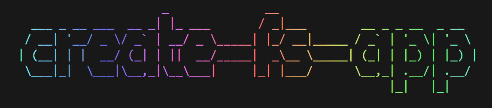
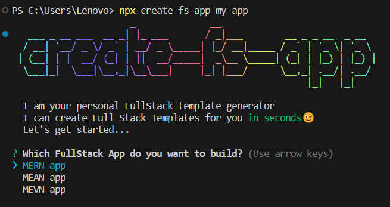

 

Create Full Stack apps with no build configuration.

- [Creating an App](#creating-an-app) – How to create a new app.
Create fs App works on macOS, Windows, and Linux.<br>
If something doesn’t work, please [file an issue](https://github.com/Om-jannu/create-fs-app/issues/new).<br>

## Quick Overview
```sh
npx create-fs-app my-app
cd my-app
```
If you've previously installed `create-fs-app` globally via `npm install -g create-fs-app`, we recommend you uninstall the package using `npm uninstall -g create-fs-app` or `yarn global remove create-fs-app` to ensure that npx always uses the latest version.

<p align="center">

</p>

### Get Started Immediately

You **don’t** need to install or configure tools like webpack or Babel.<br>
They are preconfigured and hidden so that you can focus on the code.

Create a project, and you’re good to go.

# Creating an App

**You’ll need to have Node 14.0.0 or later version on your local development machine** (but it’s not required on the server). We recommend using the latest LTS version. You can use [nvm](https://github.com/creationix/nvm#installation) (macOS/Linux) or [nvm-windows](https://github.com/coreybutler/nvm-windows#node-version-manager-nvm-for-windows) to switch Node versions between different projects.

To create a new app, you may choose one of the following methods:

### npx

```sh
npx create-fs-app my-app
```

_([npx](https://medium.com/@maybekatz/introducing-npx-an-npm-package-runner-55f7d4bd282b) is a package runner tool that comes with npm 5.2+ and higher, see [instructions for older npm versions](https://gist.github.com/gaearon/4064d3c23a77c74a3614c498a8bb1c5f))_


### Yarn

```sh
yarn create-fs-app my-app
```

_[`yarn create <starter-kit-package>`](https://yarnpkg.com/lang/en/docs/cli/create/) is available in Yarn 0.25+_

It will create a directory called `my-app` inside the current folder.<br>

No configuration or complicated folder structures, only the files you need to build your app.<br>
Once the installation is done, you can open your project folder:

```sh
cd my-app
```
